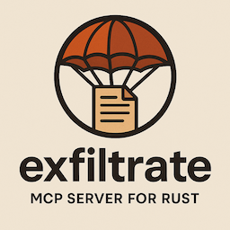

# Exfiltrate

Exfiltrate is a remote debugging framework for Rust applications.

It allows you to inspect and control a running application (even in WASM/browser environments)
from a CLI tool.  This is particularly useful when trying to debug programs with agents such as
Claude Code, Codex, Gemini, etc.



## Overview

Exfiltrate provides a simple, self-contained, and embeddable server implementation,
primarily motivated by the need to embed in debuggable programs. It is designed to be
easy to use, easy to extend with custom commands, and easy to integrate with existing Rust codebases,

Unlike traditional debuggers (gdb, lldb) which require ptrace/OS support, exfiltrate
works by embedding a small server thread into your application. This allows it to work
in constrained environments like WebAssembly, mobile devices, on remote machines, in sandboxes,
etc.

## Key Features

- **No async runtime required**: Uses threads instead of tokio, simplifying integration.
- **Embeddable**: Drop into any Rust application for debugging or agent interaction.
- **Platform support**: Works on desktop, mobile, and WebAssembly (with limitations).
- **Proxy architecture**: Enables remote debugging of browser/WASM apps via WebSockets.
- **Privacy-aware logging**: Integration with `logwise` for controlled log capture.

## Use Cases

Exfiltrate is the answer to these frequently-asked questions:

* How can I quickly expose internal state or operations of my program to a CLI?
* How can I add a custom debug command into debug builds of my program?
* How can I interact with my program running in a foreign environment, like a mobile app or browser?
* How can I steer an LLM agent to reason about my program's state at runtime?

## Quick start

claude "Run the exfiltrate_cli command, then integrate the library into my program."

### Progressive disclosure

A key design philosophy is to use a feature similar to [agent skills](https://code.claude.com/docs/en/skills)
to progressively disclose information useful to a task.  When exfiltrate starts up, it provides
a helpful menu of topics that can be perused by either humans or agents at their leisure.

Use `exfiltrate list` in the CLI to see all available commands (both built-in and custom),
and `exfiltrate help <command>` to get detailed information about any command.

### Agent use

I recommend instructing agents explicitly to use the exfiltrate command prior to debugging a Rust
program.

## Less-Quick Start

### Basic Usage

1.  Add `exfiltrate` as a dependency.
2.  Call `exfiltrate::begin()` at the start of your program.
3.  Use the `exfiltrate` CLI to connect and run commands.

### Implementing a Custom Command

```rust
use exfiltrate::command::{Command, Response};

struct HelloCommand;

impl Command for HelloCommand {
    fn name(&self) -> &'static str {
        "hello"
    }

    fn short_description(&self) -> &'static str {
        "Greets a user"
    }

    fn full_description(&self) -> &'static str {
        "Greets a user. Usage: hello [name]"
    }

    fn execute(&self, args: Vec<String>) -> Result<Response, Response> {
        let name = args.get(0).map(|s| s.as_str()).unwrap_or("World");
        Ok(format!("Hello, {}!", name).into())
    }
}

// Register the command
exfiltrate::add_command(HelloCommand);
```

## Architecture

### Why threads?

Many Rust networking libraries depend on `tokio` or other async runtimes. This makes sense for
high-concurrency servers, but it adds significant weight and complexity when you just want
to debug a program.

This codebase has no dependency on `tokio`. Instead, it just uses threads. Threads for everyone.

### WebAssembly Support

WebAssembly applications running in a browser cannot open raw TCP sockets. To support debugging
these applications, `exfiltrate` uses a proxy architecture:

1.  The WASM application connects to a local proxy (`exfiltrate_proxy`) via WebSockets.
2.  The `exfiltrate` CLI connects to the same proxy via TCP.
3.  The proxy bridges the connection, allowing the CLI to control the WASM app as if it were local.

## Feature Flags

- `logwise` - Enables integration with the `logwise` logging framework for log capture.

## Response Types

Commands can return different response types:

- **String** - Text output (most common)
- **Files** - Binary files via `FileInfo`
- **Images** - RGBA images via `ImageInfo`

For file and image responses, use the types from `command` module. Images use
`RGBA8` from the re-exported `rgb` crate.

For integration guidance, run `exfiltrate help integration`. For detailed examples of
all response types, run `exfiltrate help custom_commands` in the CLI.
